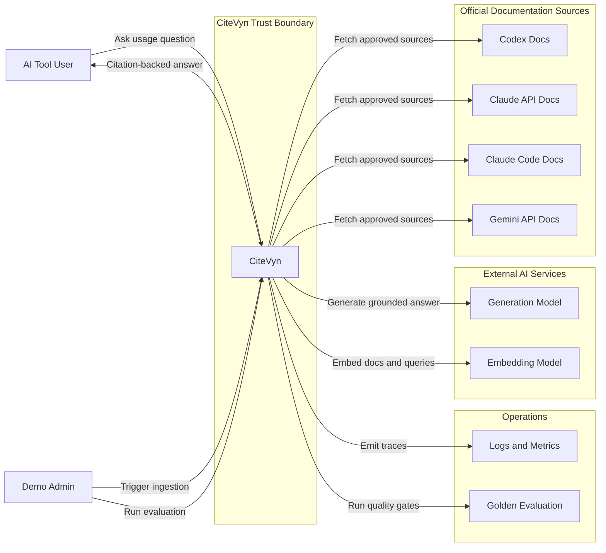

# System Context Diagram

## Purpose

Show CiteVyn as a trusted AI-tool usage assistant in its external system context.

## Scope

This diagram shows external actors, external systems, official documentation sources, model dependencies, and high-level trust boundaries. It does not show internal backend components.

## Saved File Path

`diagrams/01-system-context.md`

## Mermaid Diagram

## Short Explanation

CiteVyn accepts user questions and admin operations inside a controlled trust boundary. It only ingests approved official documentation sources and uses external model services for embeddings and grounded answer generation. Observability and evaluation are first-class external operational dependencies.

## Key Assumptions

1. MVP supports Claude API, Claude Code, Codex, and Gemini API.
2. ChatGPT and Cursor are excluded from MVP.
3. Public official documentation is still protected by source allowlisting.
4. Admin actions require stronger access than normal user questions.
5. Factual answers require citations.

## Open Questions

1. Which generation model will be selected?
2. Which embedding model will be selected?
3. Will all source docs be available through clean Markdown, or will controlled crawling be required?
