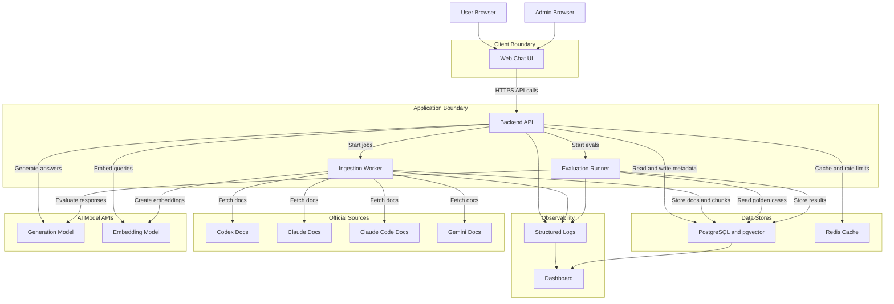

# Container Architecture Diagram

## Purpose

Show the major deployable containers, data stores, external dependencies, and runtime boundaries for the CiteVyn MVP.

## Scope

This diagram covers the MVP container-level architecture. It does not show internal backend classes or functions.

## Saved File Path

`diagrams/02-container-architecture.md`

## Mermaid Diagram

## Short Explanation

The MVP uses a simple but production-shaped set of containers: web UI, backend API, ingestion worker, evaluation runner, PostgreSQL with pgvector, Redis, and observability. Official documentation fetching happens only through the ingestion worker. User requests flow through the backend API.

## Key Assumptions

1. Docker Compose is the default MVP deployment model.
2. PostgreSQL with pgvector is sufficient for MVP scale.
3. Redis supports both cache and rate-limit state.
4. Evaluation is separated from normal request handling.
5. Model providers remain external services in MVP.

## Open Questions

1. Should the evaluator run as a separate container or an admin job in the worker?
2. Should Redis be mandatory for all environments or optional for local development?
3. Will the frontend be React, Next.js, or a simpler static UI?
