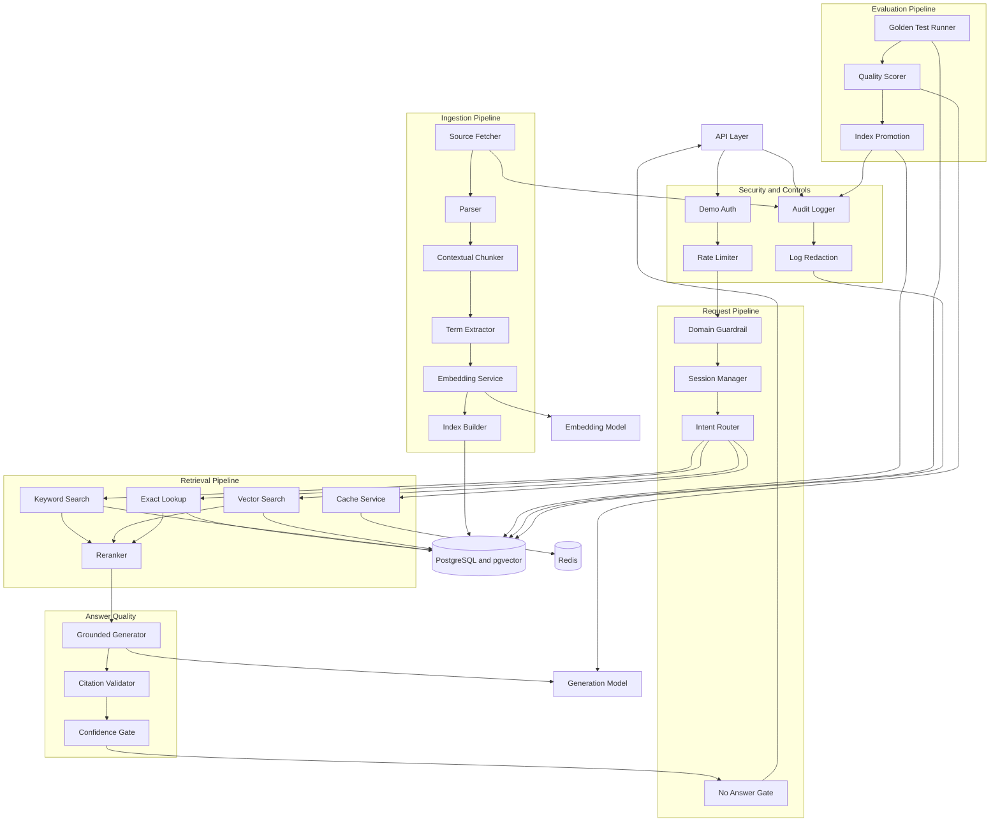

# Backend Component Architecture Diagram

## Purpose

Show the logical backend components that handle authentication, routing, retrieval, generation, citation validation, ingestion, evaluation, and audit logging.

## Scope

This diagram focuses on backend internals. It does not show deployment infrastructure.

## Saved File Path

`diagrams/03-backend-component-architecture.md`

## Mermaid Diagram

## Short Explanation

The backend is split into clear pipelines. The request pipeline handles security, domain scope, routing, retrieval, generation, citation validation, and no-answer behavior. Ingestion and evaluation are separate pipelines so bad sources or bad candidate indexes do not affect live answers.

## Key Assumptions

1. Domain guardrail runs before retrieval and generation.
2. Exact lookup is first-class and not delegated to vector search.
3. Citation validation happens before returning factual answers.
4. Candidate indexes require evaluation before promotion.
5. Audit logging is used for admin actions and critical user flows.

## Open Questions

1. Should domain guardrail be rule-based, model-based, or hybrid?
2. What reranker should be used in MVP?
3. What strictness level should citation validation enforce initially?
