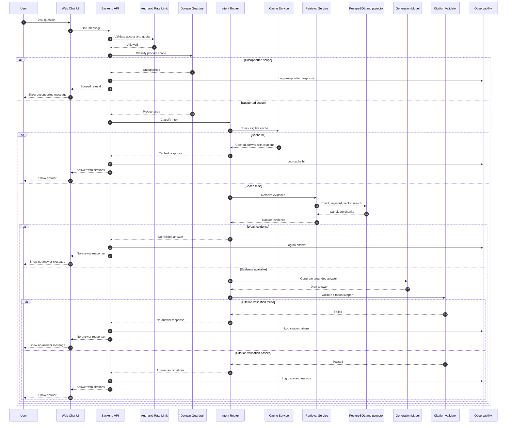

# Main Request Sequence Diagram

## Purpose

Show the main runtime sequence for a user question, including auth, routing, retrieval, answer generation, citation validation, observability, and fallback behavior.

## Scope

This diagram covers the primary user journey for asking a question through the chat UI. It includes cache, unsupported, and weak-evidence branches.

## Saved File Path

`diagrams/04-main-request-sequence.md`

## Mermaid Diagram

## Short Explanation

The runtime path protects answer quality before generation and after generation. Unsupported queries are refused early. Cache hits avoid unnecessary LLM calls. Weak evidence and citation failures produce no-answer responses instead of unsupported guesses.

## Key Assumptions

1. Domain classification happens before retrieval.
2. Cache entries require citations and source-version validation.
3. Weak evidence is treated as no-answer.
4. Citation validation failure blocks factual answers.
5. Observability records all major outcomes.

## Open Questions

1. Should answers stream in MVP or return after full validation?
2. Should citation validation use deterministic rules, an evaluator model, or both?
3. Should cache hits still run lightweight citation freshness checks?
