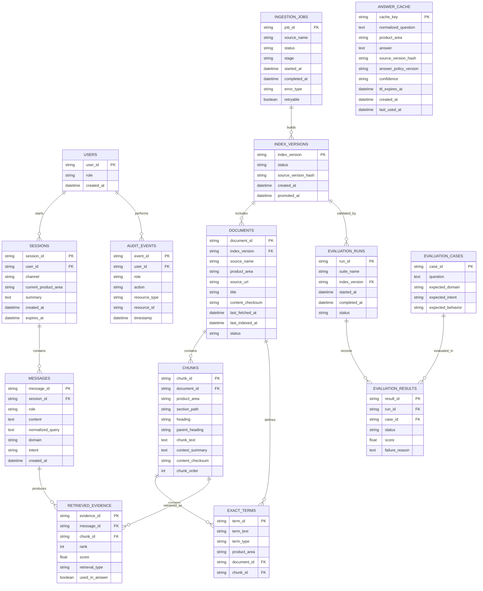

# Database ERD

## Purpose

Show the primary database entities and relationships for CiteVyn MVP.

## Scope

This ERD covers product, retrieval, cache, evaluation, ingestion, audit, and index-versioning data. It is optimized for architecture review, not final DDL.

## Saved File Path

`diagrams/05-data-model-erd.md`

## Mermaid Diagram

## Short Explanation

The model separates source documents, chunks, exact terms, conversations, retrieval evidence, cache, ingestion jobs, evaluation, audit events, and versioned indexes. This supports reliable retrieval, traceable answers, and safe index promotion.

## Key Assumptions

1. PostgreSQL stores metadata, sessions, traces, evaluations, audit events, and cache metadata.
2. pgvector stores or indexes embeddings associated with chunks.
3. Candidate indexes are versioned before promotion.
4. Exact terms are separate from chunks for reliable lookup.
5. Evaluation results are linked to index versions.

## Open Questions

1. Should embeddings be stored in the `CHUNKS` table or a separate embedding table?
2. Should `ANSWER_CACHE` citations be normalized into a separate cache-citation table later?
3. Should MVP model users as a real table or use demo-user identifiers only?
