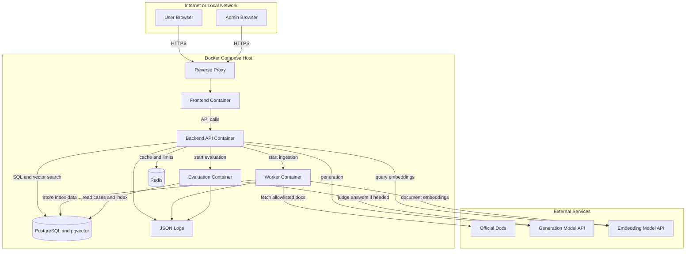

# Deployment Architecture Diagram

## Purpose

Show the MVP deployment architecture for a local or single-VM Docker Compose environment.

## Scope

This diagram covers deployment topology, service boundaries, data stores, external APIs, and basic trust boundaries. It does not define cloud-specific infrastructure.

## Saved File Path

`diagrams/06-deployment-architecture.md`

## Mermaid Diagram

## Short Explanation

The MVP runs as Docker Compose on a local machine or single VM. The reverse proxy fronts the web UI and backend. The backend handles user traffic, while worker and evaluator containers handle ingestion and test runs. Data stores remain separate from business services.

## Key Assumptions

1. Docker Compose is sufficient for controlled demo traffic.
2. A reverse proxy is optional for local-only development but recommended for cloud demo.
3. PostgreSQL and Redis run as containers for MVP.
4. Model APIs and official documentation sources are external network dependencies.
5. Kubernetes is deferred.

## Open Questions

1. Will the first demo run locally or on a cloud VM?
2. Which reverse proxy will be used?
3. How will demo secrets be injected and rotated?
4. Should logs be shipped to an external service in the first demo?
