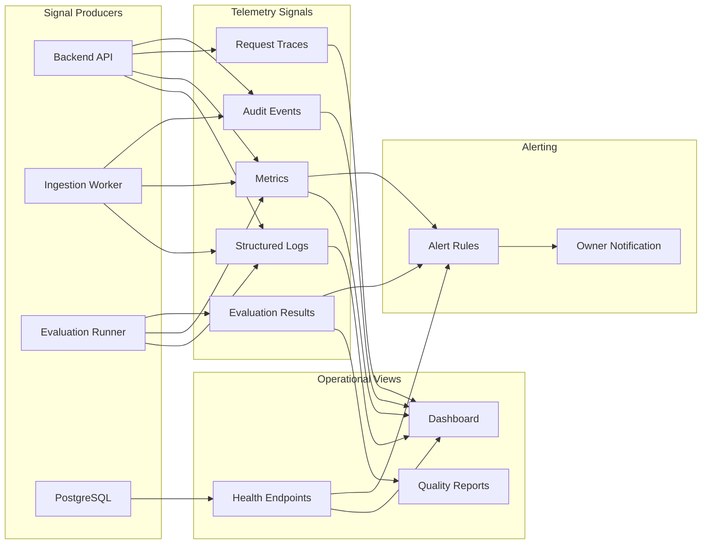

# Observability and Alerting Flow Diagram

## Purpose

Show how CiteVyn AI captures logs, metrics, traces, evaluation results, dashboards, and alerts.

## Scope

This diagram focuses on observability and alerting. It separates quality signals from business request handling.

## Saved File Path

`diagrams/07-observability-and-alerting-flow.md`

## Mermaid Diagram

## Short Explanation

Every major runtime and admin path emits telemetry. Logs, metrics, traces, audit events, and evaluation results flow into dashboards and quality reports. Alert rules notify owners about critical reliability, security, cost, and quality failures.

## Key Assumptions

1. MVP traces all demo traffic.
2. Evaluation results are observability signals, not just test artifacts.
3. Audit events are stored separately from normal logs where possible.
4. Health endpoints expose active index and dependency status.
5. Cost, no-answer rate, and citation validation failures are monitored from MVP.

## Open Questions

1. Which metrics backend will be used?
2. Which dashboard tool will be used?
3. Which alert channel will be used?
4. What exact P95 latency and daily cost thresholds should trigger alerts?
